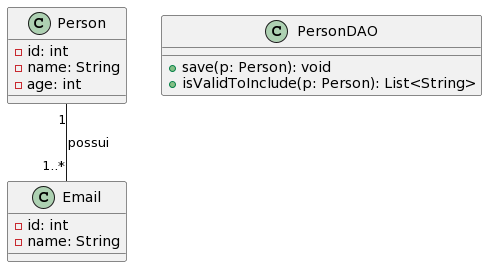

# TDDPractice

Exercícios Práticos de TDD - Entrega INDIVIDUAL (Sala e Extraclasse)
Laboratório de Desenvolvimento de Banco de Dados 5
FATEC São José dos Campos - Prof. Jessen Vidal

## Enunciado das atividades:

### [Exercício 1 - Triângulo](src/main/java/br/edu/lab5/triangulo)
Crie um conjunto de casos de teste para validar o programa a seguir:

"O programa lê três valores inteiros que representam os lados de um triângulo. O programa informa se os lados formam um triângulo isósceles, escaleno ou equilátero."

Condição: a soma de dois lados tem que ser maior que o terceiro lado. 

+ Defina o esqueleto de uma classe Java que resolva o problema acima.
+ Escreva casos de teste JUnit para as seguintes situações:
  1. Triângulo escaleno válido
  2. Triângulo isósceles válido
  3. Triângulo equilatero válido
  4. Pelo menos 3 casos de teste (CTs) para isósceles válido contendo a permutação dos mesmos valores
  5. Um valor zero
  6. Um valor negativo
  7. A soma de 2 lados é igual ao teceiro lado
  8. Para o item acima, um CT para cada permutação de valores
  9. CT em que a soma de 2 lados é menor que o terceiro lado
  10. Para o item acima, um CT para cada permutação de valores
  11. Um CT para os três valores iguais a zero

### [Exercício 2]() 
Considerando o conjunto de classes abaixo. Utilizando um a técnica de TDD, implemente o método isValidToInclude(). Esse método deve retornar uma lista de erros com base no objeto Person passado como parâmetro. Deve ser validado:

- O nome é composto por ao menos 2 partes e deve ser composto de letras
- A idade deve estar no intervalo [1, 200]
- O objeto Person deve ter pelo menos um objeto da classe Email associado
- O nome da classe Email deve estar no formato "_____@____._____", sendo que cada parte deve ter ao menos um caractere

### [Exercício 3 - Calculadora de salário](https://github.com/williamantoniazzi/TDDPractice/tree/main/src/main/java/br/edu/lab5/calcsalario) 
Aplicando a técnica de Test Driven Development (TDD), desenvolva as classes necessárias para resolver o problema descrito abaixo:

O participante deve implementar uma calculadora de salário de funcionários. Um funcionário contém nome, email, salário-base e cargo. De acordo com seu cargo, a regra para cálculo do salário líquido é diferente:

- Caso o cargo seja DESENVOLVEDOR, o funcionário terá desconto de 20% caso o salário seja maior ou igual que 3.000,00, ou apenas 10% caso o salário seja menor que isso;
- Caso o cargo seja DBA, o funcionário terá desconto de 25% caso o salário seja maior ou igual que 2.000,00, ou apenas 15% caso o salário seja menor que isso;
- Caso o cargo seja TESTADOR, o funcionário terá desconto de 25% caso o salário seja maior ou igual que 2.000,00, ou apenas 15% caso o salário seja menor que isso; e
- Caso o cargo seja GERENTE, o funcionário terá desconto de 30% caso o salário seja maior ou igual que 5.000,00, ou apenas 20% caso o salário seja menor que isso.